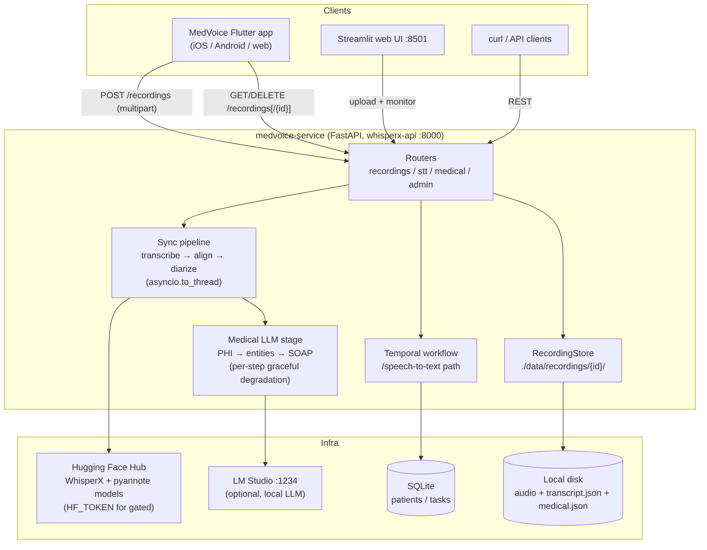
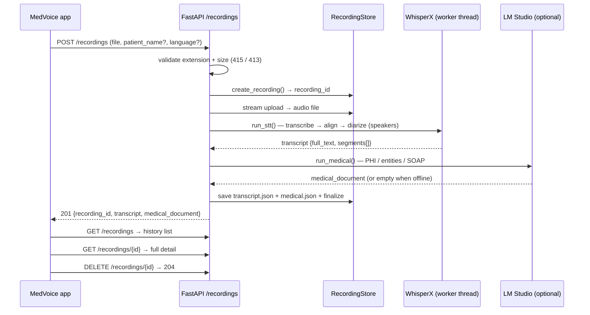

# MedVoice Service

Production-ready REST API for audio processing using WhisperX with Temporal workflow orchestration. Features transcription, alignment, diarization, and medical RAG integration with local LLMs via LM Studio.

## Features

- **Audio Transcription** - State-of-the-art speech-to-text with WhisperX
- **Speaker Diarization** - Multi-speaker identification and segmentation
- **Temporal Workflows** - Asynchronous job processing with retry logic
- **Medical Processing** - PHI detection, SOAP notes, entity extraction
- **Web Interface** - Streamlit UI for live recording and transcription
- **Local LLM Integration** - LM Studio support for medical AI

## Requirements

- Python: 3.11+
- HF_TOKEN: Required for model downloads (get from [HuggingFace](https://huggingface.co/settings/tokens))

**Software Dependencies:**
- Docker Desktop - Container runtime ([download](https://www.docker.com/products/docker-desktop/))
- LM Studio - Local LLM server for medical AI features ([download](https://lmstudio.ai/))

## Dataset

The simulated patient-physician interview dataset (OSCE respiratory cases, ~1 GB, CC0) is
**not stored in this repository** to keep clones small. Download it with:

```bash
make datasets        # downloads + extracts + verifies into datasets/
# or
python scripts/download_datasets.py
```

Source: [Springer Nature Figshare - A dataset of simulated patient-physician medical interviews](https://springernature.figshare.com/collections/A_dataset_of_simulated_patient-physician_medical_interviews_with_a_focus_on_respiratory_cases/5545842/1)

Small sample audio files (`datasets/audios/`) are kept in-repo for tests.

### Prerequisites (macOS)

**System Dependencies:**
Homebrew - Package manager for macOS ([install](https://brew.sh/))
```bash
brew install ffmpeg pkg-config make
```

**Python Package Manager:**
```bash
curl -LsSf https://astral.sh/uv/install.sh | sh
```

## Quick Start

### Docker (Recommended)

```bash
# Configure environment
cp .env.example .env
# Edit .env with your HF_TOKEN

# Install dependencies
make install

# Build and start all services
make build

# Access services
# API: http://localhost:8000/docs
# Temporal UI: http://localhost:8233
# Web UI: http://localhost:8501
```

### Local Development

Temporal CLI: Required for local development (install from [GitHub releases](https://github.com/temporalio/cli/releases))

```bash
# Configure environment
cp .env.example .env

# Install dependencies
make install

# Start full application (FastAPI + Temporal + Streamlit)
make dev
```

## Services

| Service | URL | Description |
|---------|-----|-------------|
| FastAPI | http://localhost:8000 | REST API with Scalar/Swagger docs |
| Web UI | http://localhost:8501 | Web interface for audio processing |
| Temporal UI | http://localhost:8233 | Workflow monitoring dashboard |

## Architecture

### System overview



### Recordings flow (mobile app contract, synchronous)



The `/speech-to-text` endpoints use the Temporal worker for async processing;
the recordings API is self-contained and does not require Temporal.

## API Endpoints

### Speech-to-Text
- `POST /speech-to-text` - Full processing pipeline
- `POST /speech-to-text-url` - Process from URL
- `GET /tasks/{task_id}` - Check workflow status

### Recordings (mobile app contract)
- `POST /recordings` - Upload audio (multipart: `file`, optional `patient_name`, `language`), returns `201` with `transcript` (`full_text` + speaker segments) and `medical_document` (`soap`, `entities`, `phi`)
- `GET /recordings` - List recordings, newest first
- `GET /recordings/{recording_id}` - Recording detail (meta + transcript + medical document)
- `DELETE /recordings/{recording_id}` - Delete a recording, returns `204`

Synchronous processing; Temporal not required for this path. Results are stored under
`recordings.storage_dir` in `config.yaml` (default `./data/recordings/{recording_id}/`) as
`transcript.json`, `medical.json`, `meta.json` plus the original upload. Timeout and upload
cap come from `recordings.sync_timeout_seconds` and `recordings.max_upload_mb`. SOAP,
entities, and PHI need LM Studio; without it the transcript still returns and the medical
sections come back empty.

### Medical (requires LM Studio)
- `POST /medical/process` - Full medical pipeline
- `POST /medical/soap` - Generate SOAP note
- `POST /medical/entities` - Extract medical entities
- `POST /medical/chat` - RAG-powered chatbot

### Admin
- `GET /admin` - Database interface (SqlAdmin)
- `GET /admin/patients` - List all patients
- `GET /admin/database/stats` - Database statistics

## Supported Formats

**Audio:** `.oga`, `.m4a`, `.aac`, `.wav`, `.amr`, `.wma`, `.awb`, `.mp3`, `.ogg`

**Video:** `.wmv`, `.mkv`, `.avi`, `.mov`, `.mp4`

## Available Models

**Standard Models:** `tiny`, `base`, `small`, `medium`, `large-v3-turbo`

**Distilled:** `distil-large-v3`, `distil-medium.en`, `distil-small.en`

**Specialized:** `nyrahealth/faster_CrisperWhisper` (medical)

## Development

### Commands

```bash
# Start services with Docker
make build            # Build all services
make up               # Start all services
make down             # Stop all services

# Start services without Docker
make dev              # Full application (API + Temporal + Streamlit)
make server           # FastAPI only
make worker           # Temporal + worker
make web              # Web UI only

# Stop services
make stop             # Stop all processes

# Temporal management
make temporal-fresh   # Clean restart Temporal
make check-activities # Monitor running workflows

# Testing
make test             # All tests
make unit-test        # Unit tests with coverage
make integration-test # Integration tests

# Code quality
make lint             # Run linters
make format           # Format code
```

## Medical RAG with LM Studio

### Setup

```bash
# Install LM Studio (https://lmstudio.ai/)

# Download models
# - MedAlpaca-7B or Meditron-7B (generation)
# - nomic-embed-text-v1.5 (embeddings)

# Configure .env
cp .env.example .env

# Start LM Studio server
# Local Server tab → Select model → Start Server
```

### Features

- PHI detection & anonymization
- Medical entity extraction (diagnoses, medications, procedures)
- SOAP note generation (Subjective, Objective, Assessment, Plan)
- Semantic search with vector embeddings (FAISS)

### Performance

**GPU (RTX 4090/A10):** ~15-25s per consultation
**CPU:** ~50-90s per consultation

## Documentation

- [Docker Guide](docs/DOCKER.md)
- [Temporal Retry Policies](docs/TEMPORAL_RETRY_POLICIES.md)
- [Architecture Decisions](docs/adr/)

## Troubleshooting

**Model download fails**
```bash
# Verify HF_TOKEN
curl -H "Authorization: Bearer YOUR_TOKEN" https://huggingface.co/api/whoami
```

**Temporal workflows stuck**
```bash
make temporal-fresh  # Clean restart
```

**LM Studio not responding**
```bash
curl http://localhost:1234/v1/models
```

## Related Projects

- [whisperX](https://github.com/m-bain/whisperX) - Core library
- [ahmetoner/whisper-asr-webservice](https://github.com/ahmetoner/whisper-asr-webservice)
- [alexgo84/whisperx-server](https://github.com/alexgo84/whisperx-server)

## License

MIT
